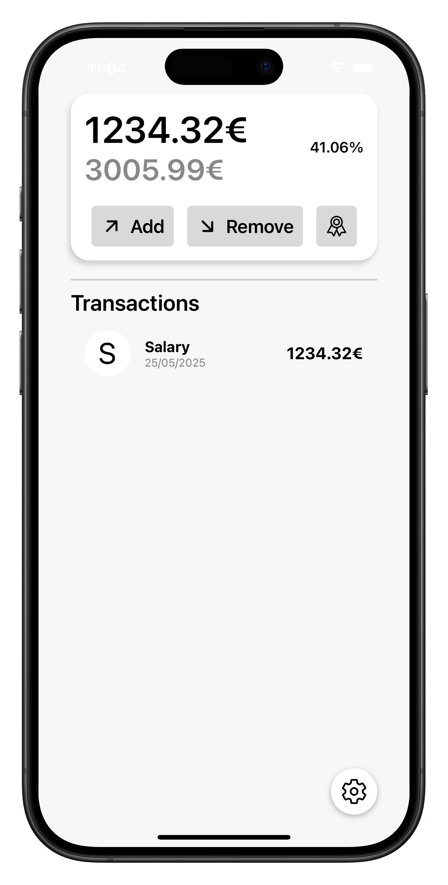
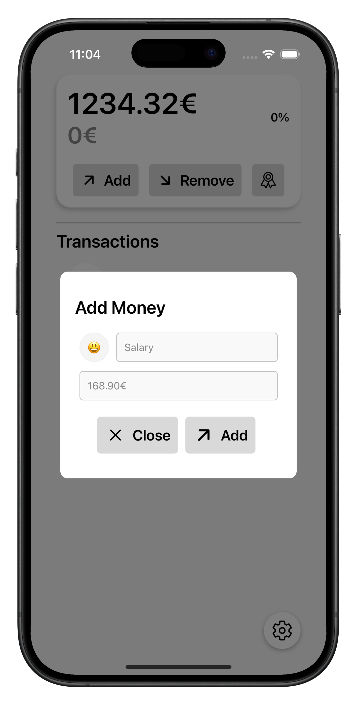

# myMonney

myMonney est une application simple et intuitive pour suivre et gérer vos dépenses quotidiennes.  
Gardez un œil sur vos finances personnelles et visualisez vos budgets.

---

## Fonctionnalités

- Ajout rapide de dépenses avec description, catégorie et montant
- Gestion des budgets mensuels
- Historique des transactions

---

## Screenshots / Mockups

### Écran principal



---

### Ajout d’une dépense



---

## Installation

1. Clonez ce dépôt :

   ```bash
   git clone https://github.com/ton-utilisateur/myMonney.git
   ```

2. Installez les dépendances :

   ```bash
   npm install
   ```

3. Lancez l’application :
   ```bash
   npm start
   ```

---

## Utilisation

- Ouvrez l’application
- Ajoutez vos dépenses en cliquant sur le bouton "+"
- Consultez vos dépenses et statistiques dans l’onglet dédié
- Modifiez ou supprimez une dépense en cliquant dessus

---

## Technologies utilisées

- Expo
- Node.js

---

## Contribution

Les contributions sont les bienvenues !  
Forkez le projet, créez une branche, faites vos modifications et envoyez une pull request.

---

## Contact

Pour toute question, contactez-moi à : louis@lesniak.fr

---

_myMonney - Gérez facilement votre budget personnel !_
